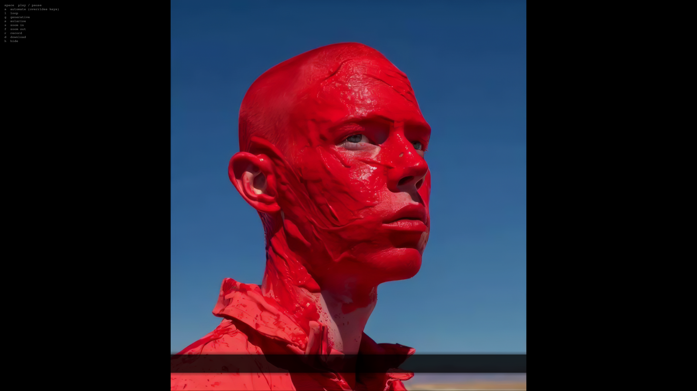

# Boys Will Be Proud



**Boys Will Be Proud** is an interactive visual piece—a satirical anthem performed as video, song, and scrolling lyric ticker. The work holds a mirror to fragile masculine pride: polo shirts as armor, craft beer at the gate, chants of glories never lived, and the loud insistence that anger is really just belonging. *We're not angry — just Boys, and Proud.*

The video plays **paused** on the first frame, doubled side by side—the right panel flipped horizontally, like facing yourself in the mirror you refuse to fight. Press **Space** to play or pause. Lyrics scroll along the bottom, synced to the track. With **automate** off, the image plays clean. Press **A** to turn automation on: red and blue saturation pulse gently with the sound—no blur, no pixelation, only the colors of the flag pushed a little harder when the music hits.

## Controls

| Key       | Action                                      |
| --------- | ------------------------------------------- |
| **Space** | Play / pause                                |
| **A**     | Toggle **automate** — audio-reactive red/blue saturation |
| **L**     | Toggle loop                                 |
| **Z**     | Zoom in (hold for slow drift)               |
| **F**     | Zoom out (hold for slow drift)              |
| **R**     | Start / stop canvas recording               |
| **D**     | Download recording as MP4                   |
| **H**     | Hide / show on-screen hints                 |

## Automate

When **automate** is off, the video plays as-is—plain, unprocessed. Press **A** while playing to enable the only visual effect: a subtle boost in red saturation (driven by bass and peaks) and blue saturation (driven by treble and level). Press **A** again to return to the raw image. **auto** appears top-right when automation is active.

## Recording

1. Press **R** to start recording the canvas (and video audio when available).
2. Press **R** again to stop.
3. Press **D** to download. Chrome may save WebM first and convert to MP4 via ffmpeg.wasm.

## Lyrics

**[Verse 1 – Baritone, march-like cadence]**  
We wear our polos like armor plates,  
drink craft beer while we guard the gates.  
We chant old glories we never knew,  
and call it war if we lose on the news.

**[Chorus – Mock gospel harmony]**  
Oh say can you see our delicate pride?  
Built on fear and a long, slow slide.  
We lost the crown, so now we shout loud:  
"We're not angry — just Boys, and Proud."

**[Verse 2 – Solo voice, theatrical]**  
They took our jobs, our flags, our fate,  
we blame the world, but show up late.  
We scream "tradition," punch the air,  
but can't define what's truly fair.

**[Chorus – Call and response]**  
(Call): Who are we?  
(Response): The last real men!  
(Call): What do we want?  
(Response): 1950 again!  
(All): We'll fight the mirror, not the lie,  
and call it "freedom" when others die.

**[Bridge – Spoken word, processed voice]**  
We cosplay as patriots, wielding memes like swords.  
We tattoo Rome on our flesh but don't read the fall.  
We fear being replaced…  
Because we replaced everyone else first.

**[Final Chorus – Slow, ironic uplift]**  
Oh say can you see, through the smoke and the crowd?  
It's just scared little boys in supremacist shrouds.  
History won't remember the volume we howled —  
Just the silence that followed  
when  
the  
flag  
was  
unfurled.

## Local Development

1. Place your performance video in the project root as `all.mov` (not included in the repo — file exceeds GitHub size limits).

2. Serve the folder with a local web server (required for video and audio — do not open as `file://`):

   ```bash
   python -m http.server 8000
   ```

3. Open `http://localhost:8000` in a browser.

## Technical Details

- **Stack:** p5.js, p5.sound, Web Audio API (`AnalyserNode` on the video element)
- **Video:** Dual panels—original left, horizontally flipped right; scaled to fit, centered
- **Lyrics:** Scrolling ticker synced to `video.time() / duration` at 90% speed
- **Effects:** Red/blue saturation overlays via soft-light blend (automate mode only)
- **Zoom:** 1× to 3.5×, smooth lerp, centered on the pair

## Credits

- Concept & Development: Marlon Barrios Solano
- Technical implementation: p5.js

## License

MIT License

Copyright (c) 2024 Marlon Barrios Solano

Permission is hereby granted, free of charge, to any person obtaining a copy
of this software and associated documentation files (the "Software"), to deal
in the Software without restriction, including without limitation the rights
to use, copy, modify, merge, publish, distribute, sublicense, and/or sell
copies of the Software, and to permit persons to whom the Software is
furnished to do so, subject to the following conditions:

The above copyright notice and this permission notice shall be included in all
copies or substantial portions of the Software.

THE SOFTWARE IS PROVIDED "AS IS", WITHOUT WARRANTY OF ANY KIND, EXPRESS OR
IMPLIED, INCLUDING BUT NOT LIMITED TO THE WARRANTIES OF MERCHANTABILITY,
FITNESS FOR A PARTICULAR PURPOSE AND NONINFRINGEMENT. IN NO EVENT SHALL THE
AUTHORS OR COPYRIGHT HOLDERS BE LIABLE FOR ANY CLAIM, DAMAGES OR OTHER
LIABILITY, WHETHER IN AN ACTION OF CONTRACT, TORT OR OTHERWISE, ARISING FROM,
OUT OF OR IN CONNECTION WITH THE SOFTWARE OR THE USE OR OTHER DEALINGS IN THE
SOFTWARE.
